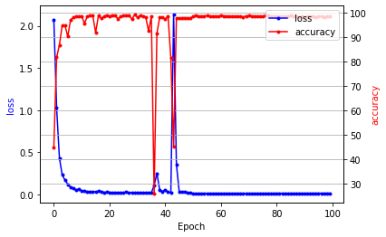
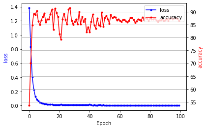
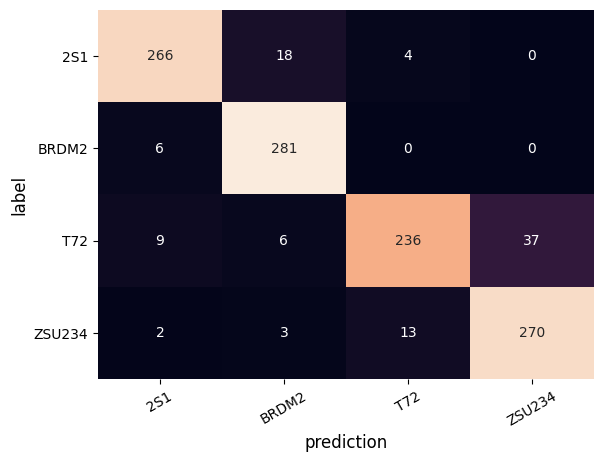
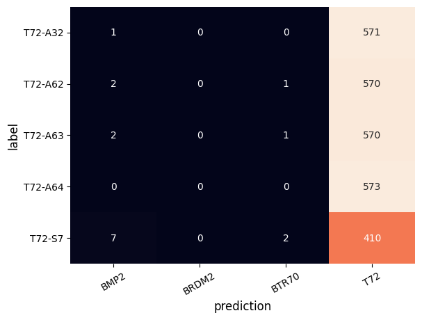
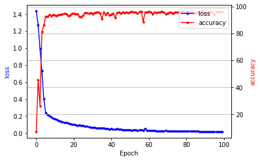
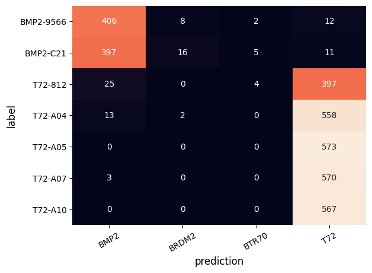
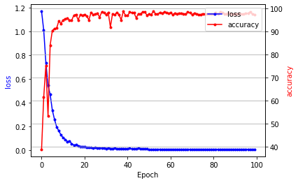
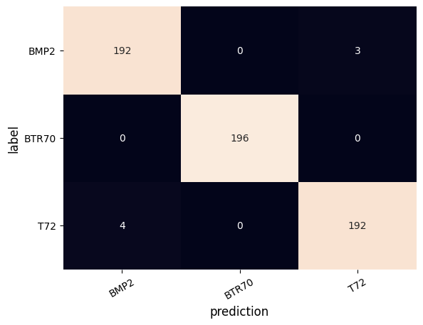
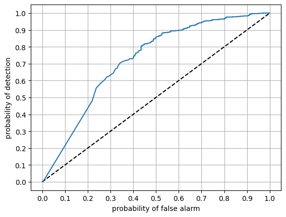

# AConvNet

### Target Classification Using the Deep Convolutional Networks for SAR Images

This repository is reproduced-implementation of AConvNet which recognize target from MSTAR dataset.
You can see the official implementation of the author at [MSTAR-AConvNet](https://github.com/fudanxu/MSTAR-AConvNet).

## Dataset

### MSTAR (Moving and Stationary Target Acquisition and Recognition) Database

#### Format

- Header
    - Type: ASCII
    - Including data shape(width, height), serial number, azimuth angle, etc.
- Data
    - Type: Two-bytes
    - Shape: W x H x 2
        - Magnitude block
        - Phase Block

Below figure is the example of magnitude block(Left) and phase block(Right)


## Model

The proposed model only consists of **sparsely connected layers** without any fully connected layers.

- It eases the over-fitting problem by reducing the number of free parameters(model capacity)

|    layer    | Input  |   Conv 1   |   Conv 2   |   Conv 3   | Conv 4 | Conv 5  |
| :---------: | ------ | :--------: | :--------: | :--------: | :----: | :-----: |
|  channels   | 2      |     16     |     32     |     64     |  128   |   10    |
| weight size | -      |   5 x 5    |   5 x 5    |   6 x 6    | 5 x 5  |  3 x 3  |
|   pooling   | -      | 2 x 2 - s2 | 2 x 2 - s2 | 2 x 2 - s2 |   -    |    -    |
|   dropout   | -      |     -      |     -      |     -      |  0.5   |    -    |
| activation  | linear |    ReLU    |    ReLU    |    ReLU    |  ReLU  | Softmax |

## Training
For training, this implementation fixes the random seed to `12321` for `reproducibility`.

The experimental conditions are same as in the paper, except for `data augmentation`.
You can see the details in `src/model/_base.py` and `experiments/config/AConvNet-SOC.json`

### Data Augmentation
 
- The author uses random shifting to extract 88 x 88 patches from 128 x 128 SAR image chips.
    - The number of training images per one SAR image chip could be increased at maximum by (128 - 88 + 1) x (128 - 88 + 1) = 1681.

- However, for SOC, this repository does not use random shifting tue to accuracy issue.
    - You can see the details in `src/data/generate_dataset.py` and `src/data/mstar.py`
    - The implementation details for data augmentation is as: 
        - Crop the center of 94 x 94 size image on 100 x 100 SAR image chip (49 patches per image chip).
        - Extract 88 x 88 patches with stride 1 from 94 x 94 image with random cropping.
    

## Experiments

You can download the MSTAR Dataset from [MSTAR Overview](https://www.sdms.afrl.af.mil/index.php?collection=mstar)
- MSTAR Clutter - CD1 / CD2
- MSTAR Target Chips (T72 BMP2 BTR70 SLICY) - CD1
- MSTAR / IU Mixed Targets - CD1 / CD2
- MSTAR / IU T-72 Variants - CD1 / CD2
- MSTAR Predictlite Software - CD1

You can download the experimental results of this repository from [experiments](https://github.com/jangsoopark/AConvNet-pytorch/releases/download/v2.2.0/experiments.zip)

### Standard Operating Condition (SOC)

|         |            | Train      |            | Test       |            |
| ------- | ---------- | ---------- | ---------- | ---------- | ---------- |
| Class   | Serial No. | Depression | No. Images | Depression | No. Images |
| BMP-2   | 9563       | 17         | 233        | 15         | 196        |
| BTR-70  | c71        | 17         | 233        | 15         | 196        |
| T-72    | 132        | 17         | 232        | 15         | 196        |
| BTR-60  | k10yt7532  | 17         | 256        | 15         | 195        |
| 2S1     | b01        | 17         | 299        | 15         | 274        |
| BRDM-2  | E-71       | 17         | 298        | 15         | 274        |
| D7      | 92v13015   | 17         | 299        | 15         | 274        |
| T-62    | A51        | 17         | 299        | 15         | 273        |
| ZIL-131 | E12        | 17         | 299        | 15         | 274        |
| ZSU-234 | d08        | 17         | 299        | 15         | 274        |

##### Training Set (Depression: 17$\degree$)

```shell
MSTAR-PublicTargetChips-T72-BMP2-BTR70-SLICY/MSTAR_PUBLIC_TARGETS_CHIPS_T72_BMP2_BTR70_SLICY
├ TARGETS/TRAIN/17_DEG
│    ├ BMP2/SN_9563/*.000 (233 images)
│    ├ BTR70/SN_C71/*.004 (233 images)
│    └ T72/SN_132/*.015   (232 images)
└ ...

MSTAR-PublicMixedTargets-CD2/MSTAR_PUBLIC_MIXED_TARGETS_CD2
├ 17_DEG
│    ├ COL1/SCENE1/BTR_60/*.003  (256 images)
│    └ COL2/SCENE1
│        ├ 2S1/*.000            (299 images)
│        ├ BRDM_2/*.001         (298 images)
│        ├ D7/*.005             (299 images)
│        ├ SLICY
│        ├ T62/*.016            (299 images)
│        ├ ZIL131/*.025         (299 images)
│        └ ZSU_23_4/*.026       (299 images)
└ ...

```

##### Test Set (Depression: 15$\degree$)

```shell
MSTAR-PublicTargetChips-T72-BMP2-BTR70-SLICY/MSTAR_PUBLIC_TARGETS_CHIPS_T72_BMP2_BTR70_SLICY
├ TARGETS/TEST/15_DEG
│    ├ BMP2/SN_9563/*.000 (195 images)
│    ├ BTR70/SN_C71/*.004 (196 images)
│    └ T72/SN_132/*.015   (196 images)
└ ...

MSTAR-PublicMixedTargets-CD1/MSTAR_PUBLIC_MIXED_TARGETS_CD1
├ 15_DEG
│    ├ COL1/SCENE1/BTR_60/*.003  (195 images)
│    └ COL2/SCENE1
│        ├ 2S1/*.000            (274 images)
│        ├ BRDM_2/*.001         (274 images)
│        ├ D7/*.005             (274 images)
│        ├ SLICY
│        ├ T62/*.016            (273 images)
│        ├ ZIL131/*.025         (274 images)
│        └ ZSU_23_4/*.026       (274 images)
└ ...

```
##### Quick Start Guide for Training

- Dataset Preparation
    - Download the [dataset.zip](https://github.com/jangsoopark/AConvNet-pytorch/releases/download/v2.2.0/dataset.zip) 
    - After extracting it, you can find `train` and  `test` directories inside `raw` directory.
    - Place the two directories (`train` and  `test`) to the `dataset/soc/raw`.
```shell
$ cd src/data 
$ python3 generate_dataset.py --is_train=True --use_phase=True --chip_size=100 --patch_size=94 --use_phase=True --dataset=soc 
$ python3 generate_dataset.py --is_train=False --use_phase=True --chip_size=128 --patch_size=128  --use_phase=True --dataset=soc
$ cd ..
$ python3 train.py --config_name=config/AConvNet-SOC.json
```

##### Results of SOC
- Final Accuracy is **99.34%** at epoch 29 (The official accuracy is 99.13%)
- You can see the details in `notebook/experiments-SOC.ipynb`

- Visualization of training loss and test accuracy



- Confusion Matrix with best model at **epoch 28**


- Noise Simulation [1]
    - i.i.d samples from a uniform distribution
    - This simulation does not fix the random seed

| Noise | 1% | 5% | 10% | 15%|
| :---: | :---: | :---: | :---: | :---: |
| AConvNet-PyTorch | 98.64 | 94.10 | 84.54 | 71.55 |
| AConvNet-Official | 91.76 | 88.52 | 75.84 | 54.68 |


### Extended Operating Conditions (EOC)

#### EOC-1 (Large depression angle change)

|         |            | Train      |            | Test       |            |
| ------- | ---------- | ---------- | ---------- | ---------- | ---------- |
| Class   | Serial No. | Depression | No. Images | Depression | No. Images |
| T-72    | A64        | 17         | 299        | 30         | 196        |
| 2S1     | b01        | 17         | 299        | 30         | 274        |
| BRDM-2  | E-71       | 17         | 298        | 30         | 274        |
| ZSU-234 | d08        | 17         | 299        | 30         | 274        |

##### Training Set (Depression: 17$\degree$)
```shell
MSTAR-PublicT72Variants-CD2/MSTAR_PUBLIC_T_72_VARIANTS_CD2
├ 17_DEG/COL2/SCENE1
│    └ A64/*.024   (299 images)
└ ...

MSTAR-PublicMixedTargets-CD2/MSTAR_PUBLIC_MIXED_TARGETS_CD2
├ 17_DEG
│    └ COL2/SCENE1
│        ├ 2S1/*.000            (299 images)
│        ├ BRDM_2/*.001         (298 images)
│        └ ZSU_23_4/*.026       (299 images)
└ ...

```

##### Test Set (Depression: 30$\degree$)

```shell
MSTAR-PublicT72Variants-CD2/MSTAR_PUBLIC_T_72_VARIANTS_CD2
├ 30_DEG/COL2/SCENE1
│    └ A64/*.024   (288 images)
└ ...

MSTAR-PublicMixedTargets-CD2/MSTAR_PUBLIC_MIXED_TARGETS_CD2
├ 30_DEG
│    └ COL2/SCENE1
│        ├ 2S1/*.000            (288 images)
│        ├ BRDM_2/*.001         (287 images)
│        ├ ZSU_23_4/*.026       (288 images)
│        └ ...
└ ...

```

##### Quick Start Guide for Training

- Dataset Preparation
    - Download the [dataset.zip](https://github.com/jangsoopark/AConvNet-pytorch/releases/download/v2.2.0/dataset.zip) 
    - After extracting it, you can find `train` and  `test` directories inside `raw` directory.
    - Place the two directories (`train` and  `test`) to the `dataset/eoc-1-t72-a64/raw`.
```shell
$ cd src/data 
$ python3 generate_dataset.py --is_train=True --use_phase=True --chip_size=100 --patch_size=94 --use_phase=True --dataset=eoc-1-t72-a64 
$ python3 generate_dataset.py --is_train=False --use_phase=True --chip_size=128 --patch_size=128  --use_phase=True --dataset=eoc-1-t72-a64
$ cd ..
$ python3 train.py --config_name=config/AConvNet-EOC-1-T72-A64.json
```

##### Results of EOC-1
- Final Accuracy is **91.49%** at epoch 17 (The official accuracy is 96.12%)
- You can see the details in `notebook/experiments-EOC-1-T72-A64.ipynb`

- Visualization of training loss and test accuracy



- Confusion Matrix with best model at **epoch 28**




#### EOC-2 (Target configuration variants)

|         |            | Train      |            | Test       |            |
| ------- | ---------- | ---------- | ---------- | ---------- | ---------- |
| Class   | Serial No. | Depression | No. Images | Depression | No. Images |
| BMP-2   | 9563       | 17         | 233        | -          | -          |
| BRDM-2  | E-71       | 17         | 298        | -          | -          |
| BTR-70  | c71        | 17         | 233        | -          | -          |
| T-72    | 132        | 17         | 232        | -          | -          |
| T-72    | S7         | -          | -          | 15, 17     | 419        |
| T-72    | A32        | -          | -          | 15, 17     | 572        |
| T-72    | A62        | -          | -          | 15, 17     | 573        |
| T-72    | A63        | -          | -          | 15, 17     | 573        |
| T-72    | A64        | -          | -          | 15, 17     | 573        |

##### Training Set (Depression: 17$\degree$)
```shell
# BMP2, BRDM2, BTR70, T72 are selected from SOC training data
```

##### Test Set (Depression: 15$\degree$)

```shell
MSTAR-PublicTargetChips-T72-BMP2-BTR70-SLICY/MSTAR_PUBLIC_TARGETS_CHIPS_T72_BMP2_BTR70_SLICY
├ TARGETS/TRAIN/17_DEG
│    └ T72/SN_S7/*.017   (228 images)
└ ...

MSTAR-PublicT72Variants-CD2/MSTAR_PUBLIC_T_72_VARIANTS_CD2
├ 17_DEG/COL2/SCENE1
│    ├ A32/*.017   (299 images)
│    ├ A62/*.018   (299 images)
│    ├ A63/*.019   (299 images)
│    ├ A64/*.020   (299 images)
├    └ ...
└ ...

MSTAR-PublicTargetChips-T72-BMP2-BTR70-SLICY/MSTAR_PUBLIC_TARGETS_CHIPS_T72_BMP2_BTR70_SLICY
├ TARGETS/TEST/15_DEG
│    └ T72/SN_S7/*.017   (191 images)
└ ...

MSTAR-PublicT72Variants-CD1/MSTAR_PUBLIC_T_72_VARIANTS_CD1
├ 15_DEG/COL2/SCENE1
│    ├ A32/*.017   (274 images)
│    ├ A62/*.018   (274 images)
│    ├ A63/*.019   (274 images)
│    ├ A64/*.020   (274 images)
├    └ ...
└ ...

```

##### Quick Start Guide for Training

- Dataset Preparation
    - Download the [dataset.zip](https://github.com/jangsoopark/AConvNet-pytorch/releases/download/v2.2.0/dataset.zip) 
    - After extracting it, you can find `train` and  `test` directories inside `raw` directory.
    - Place the two directories (`train` and  `test`) to the `dataset/eoc-2-cv/raw`.
```shell
$ cd src/data 
$ python3 generate_dataset.py --is_train=True --use_phase=True --chip_size=100 --patch_size=94 --use_phase=True --dataset=eoc-2-cv 
$ python3 generate_dataset.py --is_train=False --use_phase=True --chip_size=128 --patch_size=128  --use_phase=True --dataset=eoc-2-cv
$ cd ..
$ python3 train.py --config_name=config/AConvNet-EOC-2-CV.json
```

##### Results of EOC-2 Configuration Variants
- Final Accuracy is **99.41%** at epoch 95 (The official accuracy is 98.93%)
- You can see the details in `notebook/experiments-EOC-2-CV.ipynb`

- Visualization of training loss and test accuracy


- Confusion Matrix with best model at **epoch 95**




#### EOC-2 (Target version variants)

|         |            | Train      |            | Test       |            |
| ------- | ---------- | ---------- | ---------- | ---------- | ---------- |
| Class   | Serial No. | Depression | No. Images | Depression | No. Images |
| BMP-2   | 9563       | 17         | 233        | -          | -          |
| BRDM-2  | E-71       | 17         | 298        | -          | -          |
| BTR-70  | c71        | 17         | 233        | -          | -          |
| T-72    | 132        | 17         | 232        | -          | -          |
| BMP-2   | 9566       | -          | -          | 15, 17     | 428        |
| BMP-2   | c21        | -          | -          | 15, 17     | 429        |
| T-72    | 812        | -          | -          | 15, 17     | 426        |
| T-72    | A04        | -          | -          | 15, 17     | 573        |
| T-72    | A05        | -          | -          | 15, 17     | 573        |
| T-72    | A07        | -          | -          | 15, 17     | 573        |
| T-72    | A10        | -          | -          | 15, 17     | 567        |

##### Training Set (Depression: 17$\degree$)
```shell
# BMP2, BRDM2, BTR70, T72 are selected from SOC training data
```

##### Test Set (Depression: 15$\degree$)

```shell
MSTAR-PublicTargetChips-T72-BMP2-BTR70-SLICY/MSTAR_PUBLIC_TARGETS_CHIPS_T72_BMP2_BTR70_SLICY
├ TARGETS/TRAIN/17_DEG
│    ├ BMP2/SN_9566/*.001 (232 images)
│    ├ BMP2/SN_C21/*.002 (233 images)
│    ├ T72/SN_812/*.016   (231 images)
│    └ ...
└ ...

MSTAR-PublicT72Variants-CD2/MSTAR_PUBLIC_T_72_VARIANTS_CD2
├ 17_DEG/COL2/SCENE1
│    ├ A04/*.017   (299 images)
│    ├ A05/*.018   (299 images)
│    ├ A07/*.019   (299 images)
│    ├ A10/*.020   (296 images)
├    └ ...
└ ...

MSTAR-PublicTargetChips-T72-BMP2-BTR70-SLICY/MSTAR_PUBLIC_TARGETS_CHIPS_T72_BMP2_BTR70_SLICY
├ TARGETS/TEST/15_DEG
│    ├ BMP2/SN_9566/*.001 (196 images)
│    ├ BMP2/SN_C21/*.002 (196 images)
│    ├ T72/SN_812/*.0176  (195 images)
│    └ ...
└ ...

MSTAR-PublicT72Variants-CD1/MSTAR_PUBLIC_T_72_VARIANTS_CD1
├ 15_DEG/COL2/SCENE1
│    ├ A04/*.017   (274 images)
│    ├ A05/*.018   (274 images)
│    ├ A07/*.019   (274 images)
│    ├ A10/*.020   (271 images)
├    └ ...
└ ...

```

##### Quick Start Guide for Training

- Dataset Preparation
    - Download the [dataset.zip](https://github.com/jangsoopark/AConvNet-pytorch/releases/download/v2.2.0/dataset.zip) 
    - After extracting it, you can find `train` and  `test` directories inside `raw` directory.
    - Place the two directories (`train` and  `test`) to the `dataset/eoc-2-vv/raw`.
```shell
$ cd src/data 
$ python3 generate_dataset.py --is_train=True --use_phase=True --chip_size=100 --patch_size=94 --use_phase=True --dataset=eoc-2-vv 
$ python3 generate_dataset.py --is_train=False --use_phase=True --chip_size=128 --patch_size=128  --use_phase=True --dataset=eoc-2-vv
$ cd ..
$ python3 train.py --config_name=config/AConvNet-EOC-2-CV.json
```

##### Results of EOC-2 Version Variants
- Final Accuracy is **97.17%** at epoch 88 (The official accuracy is 98.60%)
- You can see the details in `notebook/experiments-EOC-2-VV.ipynb`

- Visualization of training loss and test accuracy



- Confusion Matrix with best model at **epoch 88**




### Outlier Rejection

|         |            | Train      |            | Test       |            | Remarks.   |
| ------- | ---------- | ---------- | ---------- | ---------- | ---------- | ---------- |
| Class   | Serial No. | Depression | No. Images | Depression | No. Images | Type.      |
| BMP-2   | 9563       | 17         | 233        | 15         | 196        | Known      |
| BTR-70  | c71        | 17         | 233        | 15         | 196        | Known      |
| T-72    | 132        | 17         | 232        | 15         | 196        | Known      |
| 2S1     | b01        | 17         | -          | 15         | 274        | Confuser   |
| ZSU-234 | d08        | 17         | -          | 15         | 274        | Confuser   |

##### Training Set (Known targets in Depression: 17$\degree$)

```shell
MSTAR-PublicTargetChips-T72-BMP2-BTR70-SLICY/MSTAR_PUBLIC_TARGETS_CHIPS_T72_BMP2_BTR70_SLICY
├ TARGETS/TRAIN/17_DEG    # KNOWN
│    ├ BMP2/SN_9563/*.000 (233 images)
│    ├ BTR70/SN_C71/*.004 (233 images)
│    └ T72/SN_132/*.015   (232 images)
└ ...

MSTAR-PublicMixedTargets-CD2/MSTAR_PUBLIC_MIXED_TARGETS_CD2
├ 17_DEG                  # Confuser
│    └ COL2/SCENE1
│        ├ 2S1/*.000            (299 images)
│        └ ZIL131/*.025         (299 images)
└ ...

```


##### Test Set (Known targets and confuser targets in Depression: 15$\degree$)
```shell
MSTAR-PublicTargetChips-T72-BMP2-BTR70-SLICY/MSTAR_PUBLIC_TARGETS_CHIPS_T72_BMP2_BTR70_SLICY
├ TARGETS/TEST/15_DEG     # KNOWN
│    ├ BMP2/SN_9563/*.000 (195 images)
│    ├ BTR70/SN_C71/*.004 (196 images)
│    └ T72/SN_132/*.015   (196 images)
└ ...

MSTAR-PublicMixedTargets-CD1/MSTAR_PUBLIC_MIXED_TARGETS_CD1
├ 15_DEG                  # Confuser
│    └ COL2/SCENE1
│        ├ 2S1/*.000            (274 images)
│        └ ZIL131/*.025         (274 images)
└ ...

```

##### Quick Start Guide for Training

- Dataset Preparation
    - Download the [dataset.zip](https://github.com/jangsoopark/AConvNet-pytorch/releases/download/v2.2.0/dataset.zip) 
    - After extracting it, you can find `train` and  `test` directories inside `raw` directory.
    - Place the two directories (`train` and  `test`) to the `dataset/confuser-rejection/raw`.

```shell
$ cd src/data 
$ python3 generate_dataset.py --is_train=True --use_phase=True --chip_size=100 --patch_size=94 --use_phase=True --dataset=confuser-rejection 
$ python3 generate_dataset.py --is_train=False --use_phase=True --chip_size=128 --patch_size=128  --use_phase=True --dataset=confuser-rejection
$ cd ..
$ 
$ # Remove Confuser objects when training to check validation accuracy with known targets
$ cd ../dataset/confuser-rejection/test
$ rm -rf 2S1
$ rm -rf ZIL131
$ cd -
$
$ python3 train.py --config_name=config/AConvNet-CR.json
$
$ # Restore the unknown targets 
$ cd ../dataset/confuser-rejection/
$ rm -rf test
$ python3 generate_dataset.py --is_train=False --use_phase=True --chip_size=128 --patch_size=128  --use_phase=True --dataset=confuser-rejection
```


##### Results of Outlier Rejection
- Final Accuracy for known targets is **98.81%** at epoch 39
- You can see the details in `notebook/experiments-CR.ipynb`

- Visualization of training loss and test accuracy
  


- Confusion Matrix with best model at **epoch 88**
  



- Outlier Rejection: TODO: LOoking for more details..
```python
# Rules
output_probability = model(image)
is_confuser = output_probability < thresh

if sum(is_confuser) == 3:
    target is confuser
else:
    target is known

```




### End-to-End SAR-ATR Cases
```shell
# Clutter images that does not contain targets.
MSTAR-PublicClutter-CD1/MSTAR_PUBLIC_CLUTTER_CD1
├ CLUTTER/15_DEG
│    └ * (50 images)
└ ...

MSTAR-PublicClutter-CD2/MSTAR_PUBLIC_CLUTTER_CD2
├ CLUTTER/15_DEG
│    └ * (50 images)
└ ...
```
### Network Architecture for Target Detection 

- Input Size: 70 X 70 or 64 x 64 (I Don't Know)

|    layer    | Input  |   Conv 1   |   Conv 2   |   Conv 3   |   Conv 4  | 
| :---------: | ------ | :--------: | :--------: | :--------: | :-------: | 
|  channels   | 2      |     32     |     32     |     32     |     2     | 
| weight size | -      |   5 x 5    |   5 x 5    |   6 x 6    |   4 x 4   | 
|   pooling   | -      | 2 x 2 - s2 | 2 x 2 - s2 | 2 x 2 - s2 |     -     | 
|   dropout   | -      |     -      |     -      |     -      |     -     | 
| activation  | linear |    ReLU    |    ReLU    |    ReLU    |  Softmax  | 


## Details about the specific environment of this repository

| | |
| :---------: | :------: |
| OS | Ubuntu 20.04 LTS |
| CPU | Intel i7-10700k |
| GPU | RTX 2080Ti 11GB |
| Memory | 32GB |
| SSD | 500GB |
| HDD | 2TB |

## Citation

```bibtex
@ARTICLE{7460942,
  author={S. {Chen} and H. {Wang} and F. {Xu} and Y. {Jin}},
  journal={IEEE Transactions on Geoscience and Remote Sensing}, 
  title={Target Classification Using the Deep Convolutional Networks for SAR Images}, 
  year={2016},
  volume={54},
  number={8},
  pages={4806-4817},
  doi={10.1109/TGRS.2016.2551720}
}
```

## References
[1] G. Dong, N. Wang, and G. Kuang, 
"Sparse representation of monogenic signal: With application to target recognition in SAR images,"
*IEEE Signal Process. Lett.*, vol. 21, no. 8, pp. 952-956, Aug. 2014.


---

## TODO

- [ ] Implementation
    - [ ] Data generation
        - [X] SOC
        - [X] EOC
        - [X] Outlier Rejection
        - [ ] End-to-End SAR-ATR
    - [ ] Data Loader
        - [X] SOC
        - [X] EOC
        - [X] Outlier Rejection
        - [ ] End-to-End SAR-ATR
    - [X] Model
        - [X] Network
        - [X] Training
        - [X] Early Stopping
        - [X] Hyper-parameter Optimization
    - [ ] Experiments
        - [X] Reproduce the SOC Results
        - [X] Reproduce the EOC Results
        - [X] Reproduce the outlier rejection
        - [ ] Reproduce the end-to-end SAR-ATR

